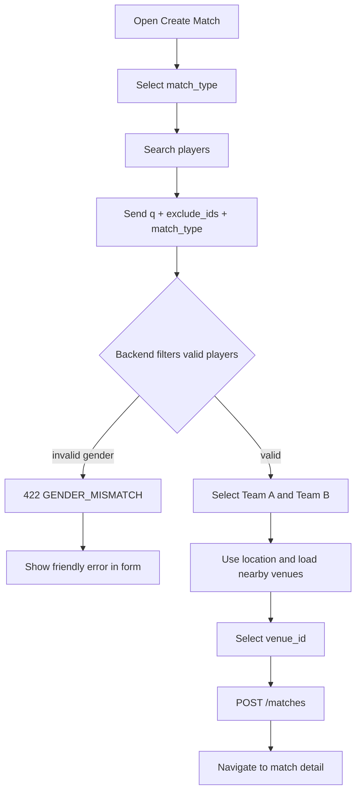
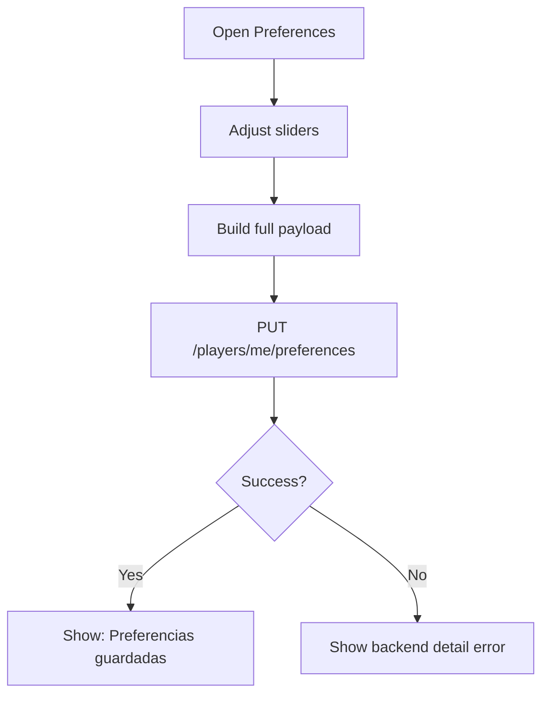

# Critical Flow Bugfixes - 2026-04-14

## Scope
This document covers backend and frontend fixes for critical flows in:
- Match creation
- Preferences and partnerships
- Match detail/confirmation lifecycle
- Avatar upload

## Implemented Fixes

### 1) Match Creation

#### 1.1 Gender validation mismatch
- Backend now returns `422` with explicit payload when selected players violate match type gender constraints.
- Error payload shape:
```json
{
  "error_code": "GENDER_MISMATCH",
  "message": "gender mismatch for selected match type: cannot add female players to a male match"
}
```
- Frontend now parses this error and renders a user-friendly message instead of generic `400` text.
- Player search picker filters players by selected `match_type` (`male`/`female`).

#### 1.2 Location selector (venue-based)
- Match creation UI now uses a club/court selector (venues API) instead of showing raw coordinates only.
- New UX flow:
1. User taps "Use my location"
2. App fetches nearby venues
3. User selects venue from dropdown
4. Request sends `venue_id`
- Placeholder text: `Elegi el club o cancha`.

#### 1.3 Duplicate player exclusion across teams
- Frontend now sends `exclude_ids` and `match_type` in `/players/search`.
- Backend parses `exclude_ids` and excludes those players from search results.
- Frontend still enforces local exclusion guard as secondary protection.

### 2) Preferences and Partnerships

#### 2.1 Preferences persistence
- Preferences write path now always sends a complete payload:
- `radar_radius_km`
- `elo_min_delta`
- `elo_max_delta`
- This prevents zero-value overwrites caused by partial requests.
- UI shows explicit success feedback: `Preferencias guardadas`.

#### 2.2 Sent partnership names
- Backend now includes pending requests in `GET /partnerships/me` data source.
- Added endpoint `GET /partnerships/requests/sent` with shape:
```json
{
  "requests": [
    {
      "id": "...",
      "status": "pending",
      "requested_user": { "id": "...", "full_name": "..." },
      "created_at": "..."
    }
  ]
}
```
- Frontend refreshes partnerships after creating a request so names are rendered immediately.

#### 2.3 Conflict (409) messages for duplicate partnerships
- Frontend maps `409` responses to friendly text:
`Ya existe una solicitud de pareja o una relacion activa con esa jugadora/jugador.`

### 3) Match Detail and Completion UX

#### 3.1 Navigation back to home
- Match detail page now has:
- Back fallback route to `/matchmaking`
- Explicit CTA: `Volver al inicio`

#### 3.2 Manual refresh in match detail
- Added refresh action in header (`Refresh` icon).
- Refresh triggers re-fetch of list + selected match binding.

#### 3.3 Confirm/dispute action reliability
- Confirm/dispute screen now fetches match if memory state is missing.
- Store no longer assumes backend returns full match object for confirm/dispute endpoints.
- Local state is updated by status transition and then refreshed from server.

#### 3.4 Avatar upload failures
- Frontend now sends multipart file with field name `avatar` (backend-compatible).
- Error feedback now uses backend detail when available (file too large, invalid mime, etc).

## API Contract Updates

### Player Search
`GET /players/search`
Query params:
- `q`: string
- `exclude_ids`: comma-separated UUIDs
- `match_type`: `male|female|mixed`

### Match Create Error Contract
`POST /matches`
Possible validation error:
- `422` + `error_code=GENDER_MISMATCH`

### Partnerships
- `GET /partnerships/me` now includes pending + accepted
- New `GET /partnerships/requests/sent`

## Corrected Flow Diagrams

### Match creation flow


### Preferences save flow


### Confirm/dispute + refresh flow
```mermaid
flowchart TD
  A[Match Detail] --> B[Tap Confirm or Dispute]
  B --> C[Load ConfirmDispute screen]
  C --> D{Match in store?}
  D -->|No| E[fetchMatch(id)]
  D -->|Yes| F[Enable action buttons]
  E --> F
  F --> G{Confirm or Dispute}
  G -->|Confirm| H[POST /matches/:id/confirm]
  G -->|Dispute| I[POST /matches/:id/dispute]
  H --> J[Update local status]
  I --> J
  J --> K[refreshMatch(id)]
  K --> L[Updated UI state]
```

## Verification Checklist
- [x] Gender mismatch returns `422` with explicit error code
- [x] Frontend catches and renders user-friendly validation text
- [x] Venue selector replaces raw coordinate-only UX
- [x] Search excludes already selected players through backend query params
- [x] Preferences save sends complete payload and displays success
- [x] Partnership sent names resolve correctly after request
- [x] Conflict 409 message is human-readable
- [x] Match detail has explicit return-to-home action
- [x] Match detail has manual refresh
- [x] Confirm/dispute flow updates state reliably
- [x] Avatar upload uses correct multipart field and better error messages
